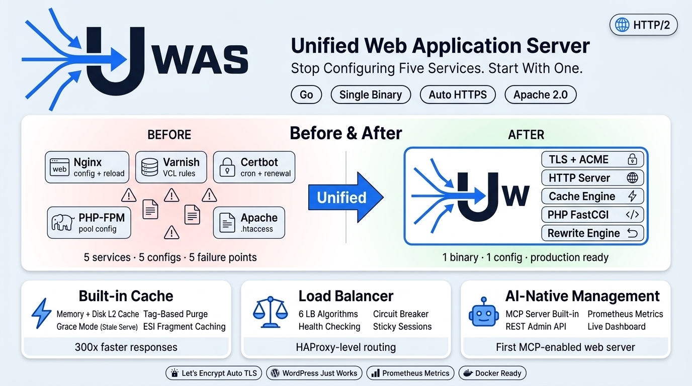

# UWAS

**Unified Web Application Server**

One binary to serve them all.

Apache + Nginx + Varnish + Caddy → UWAS

---

<p align="center">
  
</p>

[](https://go.dev)
[](LICENSE)

## What is UWAS?

UWAS replaces your entire web server stack — Apache, Nginx, Varnish, Certbot — with a single Go binary. Auto HTTPS, built-in caching, PHP support, .htaccess compatibility, reverse proxy with load balancing, and an AI-ready MCP interface.

One binary. Zero hassle. Production ready.

## Features

- **Auto HTTPS** — Let's Encrypt certificates with zero configuration
- **Built-in Cache** — Varnish-level caching with grace mode, tag-based purge
- **PHP Ready** — FastCGI with connection pooling and .htaccess support
- **Load Balancer** — 5 algorithms, health checks, circuit breaker
- **URL Rewrite** — Apache mod_rewrite compatible engine
- **Observable** — Prometheus metrics, structured JSON logs, admin dashboard
- **AI-Native** — MCP server for LLM-driven management
- **Secure** — WAF rules, rate limiting, security headers, blocked paths
- **Single Binary** — No dependencies, just download and run

## Quick Start

```bash
# Build from source
go install github.com/uwaserver/uwas@latest

# Or build locally
git clone https://github.com/uwaserver/uwas.git
cd uwas
make build

# Serve a static site
./bin/uwas serve -c uwas.yaml
```

## Configuration

UWAS uses a single YAML file. See [`uwas.example.yaml`](uwas.example.yaml) for a full reference.

### Static Site

```yaml
global:
  http_listen: ":80"
  https_listen: ":443"
  acme:
    email: you@example.com

domains:
  - host: example.com
    root: /var/www/html
    type: static
    ssl:
      mode: auto
```

### WordPress / PHP

```yaml
domains:
  - host: blog.example.com
    root: /var/www/wordpress
    type: php
    ssl:
      mode: auto
    php:
      fpm_address: "unix:/var/run/php/php8.3-fpm.sock"
    htaccess:
      mode: import
    cache:
      enabled: true
      ttl: 1800
```

### Reverse Proxy

```yaml
domains:
  - host: api.example.com
    type: proxy
    ssl:
      mode: auto
    proxy:
      upstreams:
        - address: "http://127.0.0.1:3000"
          weight: 3
        - address: "http://127.0.0.1:3001"
          weight: 1
      algorithm: least_conn
      health_check:
        path: /health
        interval: 10s
```

## Requirements

| Component | Minimum | Recommended | Notes |
|-----------|---------|-------------|-------|
| Go | 1.23+ | 1.26+ | For building from source |
| PHP | 7.4+ | 8.3+ / 8.4+ | Only needed for PHP sites |
| PHP-FPM | Any | 8.3-fpm | Linux/macOS: `php-fpm`, Windows: `php-cgi -b` |

**PHP compatibility tested with:** PHP 8.1, 8.2, 8.3, 8.4

**Supported PHP connection modes:**
- Unix socket: `fpm_address: "unix:/var/run/php/php8.3-fpm.sock"` (Linux/macOS)
- TCP: `fpm_address: "tcp:127.0.0.1:9000"` (all platforms)

**No PHP needed** for static sites, reverse proxy, or redirect domains.

## CLI

```
uwas serve    -c uwas.yaml     Start the server
uwas version                    Print version info
uwas config   validate -c ...   Validate a config file
uwas config   test -c ...       Show parsed config details
uwas help                       Show help
```

## Architecture

```
Request Flow:

  TCP → TLS (SNI routing)
    → HTTP Parse
      → Middleware Chain:
          Recovery → Request ID → Security Headers → Access Log
        → Virtual Host Lookup
          → Security Guard (blocked paths, WAF)
            → Rewrite Engine (mod_rewrite compatible)
              → Cache Lookup (L1 memory + L2 disk)
                → Handler:
                    ├── Static File  (ETag, Range, pre-compressed, SPA)
                    ├── FastCGI/PHP  (connection pool, CGI env)
                    ├── Reverse Proxy (5 LB algorithms, circuit breaker)
                    └── Redirect     (301/302/307/308)
              → Cache Store
    → Response
```

## Project Layout

```
cmd/uwas/                → CLI entry point
internal/
  admin/                 → REST API (health, stats, domains, metrics)
  build/                 → Version info (ldflags)
  cache/                 → L1 memory (256-shard LRU) + L2 disk cache
  cli/                   → CLI framework and commands
  config/                → YAML parser, validation, defaults
  handler/
    fastcgi/             → PHP handler, CGI environment builder
    proxy/               → Reverse proxy, load balancing, health checks
    static/              → Static files, MIME, ETag, pre-compressed
  logger/                → Structured logger (slog wrapper)
  mcp/                   → MCP server for AI management
  metrics/               → Prometheus-compatible metrics
  middleware/            → Chain, recovery, request ID, rate limit, gzip, CORS, WAF
  rewrite/               → URL rewrite engine, conditions, variables
  router/                → Virtual host routing, request context
  server/                → HTTP/HTTPS server, dispatch, error pages
  tls/                   → TLS manager, ACME client, auto-renewal
    acme/                → RFC 8555 ACME protocol, JWS signing
pkg/
  fastcgi/               → FastCGI binary protocol, connection pool
  htaccess/              → .htaccess parser and converter
```

## Comparison

| Feature | UWAS | Nginx | Caddy | Apache | LiteSpeed |
|---------|------|-------|-------|--------|-----------|
| Single binary | Yes | No | Yes | No | No |
| Auto HTTPS | Yes | No | Yes | No | Yes |
| Built-in cache | Yes | No | No | No | Yes |
| PHP FastCGI | Yes | Yes | Yes | Yes | Yes |
| .htaccess support | Yes | No | No | Yes | Yes |
| Load balancer | Yes | Yes | No | No | Yes |
| WAF | Basic | No | No | Mod | Yes |
| MCP / AI-native | Yes | No | No | No | No |
| Open source | Apache 2.0 | BSD | Apache 2.0 | Apache 2.0 | Proprietary |

## Docker

```bash
docker build -t uwas .
docker run -p 80:80 -p 443:443 -v ./uwas.yaml:/etc/uwas/uwas.yaml uwas
```

## Admin API

When `admin.enabled: true`, the REST API is available at `127.0.0.1:9443`:

```
GET  /api/v1/health       → Server health status
GET  /api/v1/stats        → Request/cache/connection statistics
GET  /api/v1/domains      → List configured domains
GET  /api/v1/config       → Show sanitized configuration
GET  /api/v1/metrics      → Prometheus text format metrics
POST /api/v1/reload       → Trigger config reload
POST /api/v1/cache/purge  → Purge cache entries
```

Protected with `Authorization: Bearer <api_key>` when `admin.api_key` is set.

## MCP Server

UWAS includes a built-in MCP (Model Context Protocol) server for AI-driven management:

**Tools:**
- `domain_list` — List all configured domains
- `stats` — Get server statistics
- `config_show` — Show current configuration
- `cache_purge` — Purge cache by tag or all

## Development

```bash
make dev        # Build development binary
make test       # Run all tests
make lint       # Run go vet + staticcheck
make clean      # Clean build artifacts
```

## License

[Apache License 2.0](LICENSE)

## Contributing

1. Open an issue first to discuss
2. One feature/fix per PR
3. Tests required
4. `go vet` must pass
